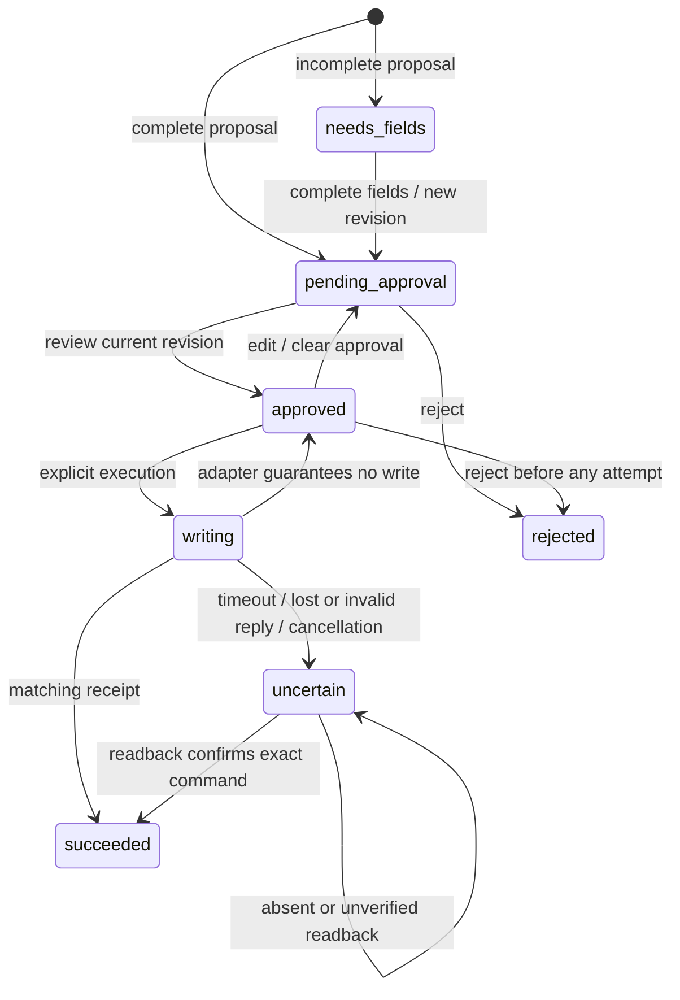

# UX-012/014 — dormant sandbox workflow

This checkpoint implements independent control logic and a result-view scaffold. It does not establish a real CRM integration. There is no channel webhook, CRM adapter, endpoint, credential or new environment variable, and no public route displays the new component. No messages were sent and no remote CRM records were written.

## Implemented boundaries

`backend/app/crm/models.py` defines bounded immutable normalized input, proposed fields, sandbox target, revision, command and receipt. `InboundEvent` accepts email or WhatsApp as a channel label, not as proof that an event arrived through an official channel. A future authenticated channel adapter must normalize and verify the original event. No AI extraction or arbitrary URL fetch occurs here.

Required proposed values are the customer reference, summary and responsible owner. Missing fields prevent approval/write; the only proposed status is `new`. The coordinator does not resolve customer identity or validate owner permissions in the real CRM. That mapping must be implemented for the selected sandbox.

`SandboxWorkflow` keeps bounded, process-local entries (100 by default, maximum 1000), protected by a lock. The event identity is namespaced by sandbox, channel, account and event ID. Exact replay returns the current proposal; changed input with the same identity is rejected. Capacity rejects additional events instead of evicting deduplication state. The original message is not retained in an entry; its digest and the proposed fields are. These fields and digests must not be assumed anonymous.



Edits increment the revision and invalidate approval. Execution checks the current approved revision and atomically claims the attempt before awaiting the adapter. No editing is allowed after an attempt, including a definite non-write failure. Exact replay of a successful command returns the existing result. A receipt must match the target, idempotency key and approved fields.

Ambiguous outcomes do **not** trigger a second write. Reconciliation reads by the original key; absent data remains uncertain because it may reflect eventual consistency. A verified `DefinitelyNotWritten` failure permits explicit retry of the same immutable approved command/key. The adapter must never classify connection loss or a generic 5xx as definitely not written. Timeout is bounded but assumes cooperative async cancellation; the future adapter must also enforce transport timeouts.

## What this does not guarantee

* The approval actor string is an audit label, not authentication. A real operator interface needs authenticated identity, authorization, a server-stored revision binding and appropriate request protection. No approval button is exposed publicly.
* `environment="sandbox"` and matching adapter target metadata do not enforce network isolation. The real adapter must restrict actual host/account/workspace and credentials to an explicitly approved sandbox; no production credentials or send-message permission.
* Process memory is not durable storage. Entries disappear on restart and are not shared between Cloud Run instances. Before activation, add persistent atomic event/approval/execution storage and recovery, and verify the provider's atomic same-key semantics. Stable keys alone do not prevent duplicate remote records.
* There is no general CRM compatibility claim. Customer matching, allowed owner/status mapping, webhook signature/replay verification and provider errors depend on the selected services.

## Result view and publication gate

`frontend/src/app/shared/crm-run-result.component.*` is a read-only, currently unmounted component: message, proposal/approval, result. Missing fields and uncertain status are explicit; a record ID appears only for success. Test-adapter success explicitly says it is not CRM proof. No send/retry/approve control or HTTP call exists. The view model still requires an authenticated backend mapping; visual/browser/physical accessibility checks must accompany actual mounting. Unit tests verify escaping, missing/uncertain states and test-result labelling.

`backend/app/crm/artifacts.py` defines an offline evidence manifest and local-file integrity gate. It requires a declared real sandbox run, synthetic data, execution date, target/event/record references, scope, limitations, review reference, approval/duplicate/missing-field/field-match/privacy checks, plus trace and screenshot/recording files with SHA-256. WhatsApp also requires official-channel verification. Fixture origin, missing or altered files, path escapes, future dates and incomplete review fail. Files are bounded to 20 MiB each, at most four; manifests to 64 KiB.

The gate verifies metadata completeness and file bytes, **not** media validity, the truth of a remote write, authorization or rights. Tests intentionally demonstrate that truthful operator review is still needed. A successful CLI result means eligible for manual review, never automatic publication. No manifest containing real execution evidence is available or published in this checkpoint.

```powershell
# From repository root, after backend dev lock and editable installation:
backend/.venv/Scripts/python.exe -m pytest backend/tests/unit/test_crm_workflow.py backend/tests/unit/test_crm_artifacts.py
# Once a reviewed private package actually exists, use its local manifest path:
backend/.venv/Scripts/python.exe backend/scripts/validate_crm_artifact.py <path-to-reviewed-manifest>
```

The path token above documents a CLI argument, not a production configuration value. The manifest's field names/types are the `CrmArtifact` schema; do not create a pre-filled `sandbox-run` example that could be mistaken for evidence. Keep private capture material outside public assets and commit only reviewed synthetic/redacted artifacts.

## Actual sandbox setup and acceptance still required (B-003/B-005)

1. Owner identifies the CRM sandbox/workspace and official test channel/account, confirms permissions, synthetic participants, customer/owner/status mapping and a private retention/cleanup plan. Record credential **reference names** only. Review the proposed data flow before connection.
2. Build the actual adapter and verify sandbox isolation, durable atomic idempotency, same-key/different-fields rejection, actual readback, transport cancellation and error classification. Build the official channel ingress with provider signature and replay verification. No customer/production CRM or outbound conversation sending in the public demo.
3. Bind authenticated human approval to the server-stored proposal revision and add durable state/recovery. Map the view to actual normalized events and returned records. Do not activate a public write endpoint as a substitute for an operator-controlled run.
4. Execute synthetic success, missing-field, rejected/stale approval, duplicate/retry, concurrent event, and lost-response/readback scenarios. Test restart/multi-worker behavior against the real provider. Store timestamps, source event ID, approved mapping and actual record/status; preserve every failure. No measured savings without a comparable measurement.
5. Capture the three-step result and sanitized trace from those executions. For WhatsApp show the official channel provenance and real event-to-record mapping. Review all media/rights/data, run the manifest gate, then connect a reviewed artifact to the existing evidence registry and service-specific proof CTA. Do not use the generic email report as proof of WhatsApp integration.
6. Verify desktop/mobile layout, keyboard/focus, error recovery, physical screen reader, current privacy disclosures and all deployment gates. UX-012 and UX-014 remain PARTIAL until actual sandbox execution and publication criteria are met.
